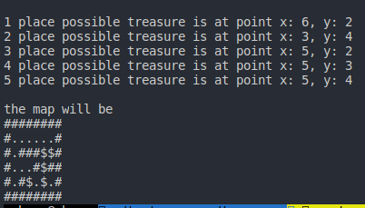

# Treasure

game treasure hunt

## Playing Arena

```
########
#......#
#.###..#
#...#.##
#X#....#
########

X = represent player position
# = represent obstacle
. = reprensent clear path
```

## Goal

1. The program must output a list of probable coordinate points where the treasure might be located.
2. Display the grid with all the probable treasure locations marked with a $ symbol.

## Rule

From the starting position, the user must navigate in a specific order:
1. Up/North A step(s), then
2. Right/East B step(s), then
3. Down/South C step(s).

## Strategy

1. Player will mark the path that has been traversed
2. When player have a three way path, the three-way coordinate path also remaked. And player still will move with the current move
3. When player can move futher because the obstacle, player will change the next move. or the path already traversed before. Player will return to the three-way coordinate.
4. When player return the three-way coordinate, he will check the path that he has travelsed before. And change move to the path that never traveled
5. Until he got the last move (down) and mark it as probable coordinate treasure location
6. If player still can be move down, he also marked all the move down coordinate with probable coordinate treasure location
7. Program will end when player doesn't have a move down and all the three-way coordinate has been traversed

## Output

